# Stage 6 — Flow Mapping & Multi-Agent Routing

> Versão: 2.0 | Data: 2026-03-16 | Agente líder: Engineer + PM
> Atualizado para refletir Motor de Negociação, EscalationService, e Delegação de Contato (45 edge cases).

---

## Overview

Este artefato mapeia todos os fluxos possíveis do agente — o happy path já implementado e todos os branches alternativos identificados nos Stages 4 e 5. Também documenta o estado atual da implementação versus o que precisa ser construído, e define critérios exatos de handoff para intervenção humana.

---

## Descobertas Técnicas (leitura do código)

Antes do mapeamento de fluxos, as seguintes descobertas diretas do código são relevantes para o design:

| Achado | Impacto |
|---|---|
| **Estado em Redis, não MongoDB** — `state_machine_service.py` usa `redis.from_url`. CLAUDE.md diz MongoDB. | Divergência doc/código. Redis tem TTL de 24h — estado expira automaticamente. MongoDB teria persistência duradoura. Decisão a confirmar |
| **Chave de estado = `user_id` = phone number** — não há `meeting_id` como chave | EC-12 (trigger duplicado) se torna crítico: dois triggers para o mesmo mentor criariam conflito de estado |
| **Timeout configurável via env** — `NO_RESPONSE_TIMEOUT_SECONDS = 30` era fixo em `handlers.py:38`; agora lê de `settings.no_response_timeout_seconds` (default `172800` = 48h). Var de ambiente: `NO_RESPONSE_TIMEOUT_SECONDS` | Gap de dev encerrado. Valor de produção deve ser definido explicitamente no `.env` |
| **Sem EscalationService** — todas as transições para `HUMAN_INTERVITION_REQUIRED` são silenciosas; nenhuma notificação é enviada ao AEE | Gap crítico sistêmico. O AEE não sabe quando o agente escala. Derruba H12 (confiança do AEE no agente) |
| **Google Calendar não implementado** — confirmação é enviada ao mentor e founder via WhatsApp, mas nenhum evento é criado no GCal | Founders e mentores não recebem invite de calendário. Gap para o happy path completo |
| **Celery task com `ignore_result=True` e sem retry strategy** — mensagens podem ser perdidas silenciosamente em caso de falha | Risco operacional. Mensagens descartadas sem log ou reprocessamento |
| **Terminal states resetam o estado completamente** — após CONFIRMED/REJECTED/HUMAN_INTERVENTION, estado é apagado | Sem histórico de conversas para análise pós-piloto. Problema para métricas (Stage 7) |
| **Terminologia código vs. docs diverge** — código usa `donated`/`received`; docs usam `mentor`/`founder` | Confusão para novos devs. `donated` = mentor (quem doa o tempo); `received` = founder |
| **Typo em estado crítico** — `HUMAN_INTERVITION_REQUIRED` (deveria ser INTERVENTION) | Presente em `state_machine_service.py:43` e `handlers.py:62,84,114,177` |

---

## 1. Estado Atual da Máquina de Estados

### Estados existentes (implementados)

```
INIT
WAITING_FOR_TEMPLATE_REPLY      ← definido mas sem handler no STATE_HANDLERS
WAITING_DONATED_RESPONSE        ← donated = mentor
DONATED_REJECTED_SLOTS          ← terminal → reseta estado
DONATED_NO_RESPONSE             ← terminal → reseta estado
DONATED_SELECTED_SLOT           ← intermediário, não tem handler próprio
WAITING_RECEIVED_RESPONSE       ← received = founder
RECEIVED_REJECTED               ← terminal → reseta estado
RECEIVED_NO_RESPONSE            ← terminal → reseta estado
RECEIVED_CONFIRMED              ← terminal → reseta estado
HUMAN_INTERVITION_REQUIRED      ← terminal → reseta estado (typo)
```

### Handlers implementados (STATE_HANDLERS)

```python
INIT                        → handle_init
WAITING_DONATED_RESPONSE    → handle_waiting_donated
WAITING_RECEIVED_RESPONSE   → handle_waiting_received
HUMAN_INTERVITION_REQUIRED  → handle_human_intervention_required
RECEIVED_CONFIRMED          → handle_received_confirmed
```

> `WAITING_FOR_TEMPLATE_REPLY` está na lista de estados válidos mas não tem handler. Lacuna de implementação.

---

## 2. Happy Path (implementado)

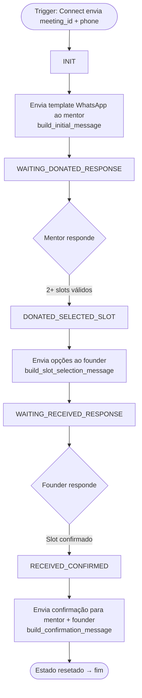

**Notas de implementação:**
- Mentor = `donated`; Founder = `received` (terminologia do código)
- Confirmação enviada para ambos (`donated_phone` e `received_phone`)
- Após RECEIVED_CONFIRMED: estado é apagado do Redis
- GCal invite: ainda não implementado

---

## 3. Flows Alternativos (parcialmente implementados ou não implementados)

### Flow 3A — Mentor fornece apenas 1 slot

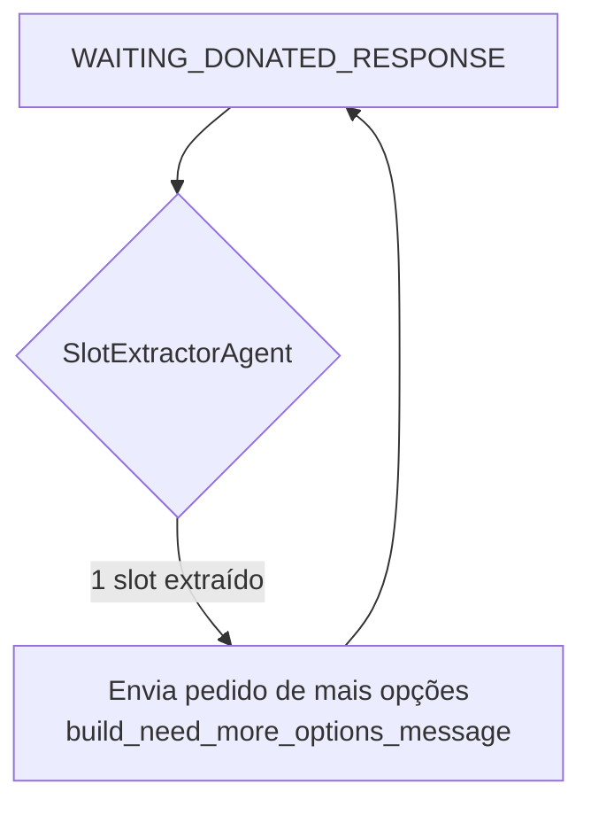

**Status:** ✅ Implementado (`handlers.py:105–107`). Estado não avança — mentor recebe pedido e pode responder novamente.

---

### Flow 3B — Mentor fornece resposta não reconhecida / ambígua

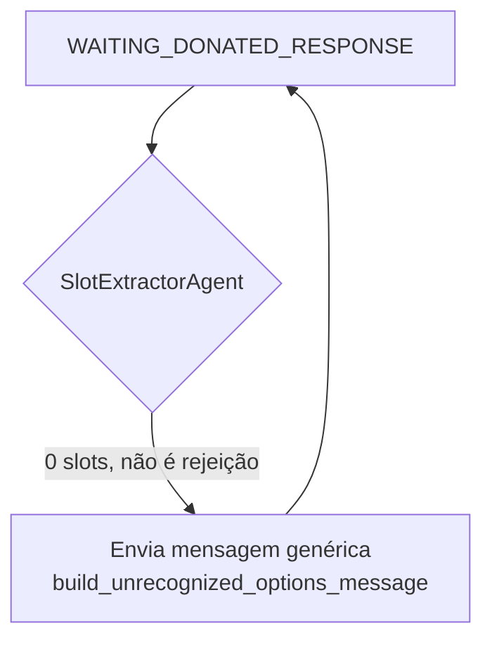

**Status:** ✅ Implementado (`handlers.py:109`). Estado não avança — aguarda nova resposta do mentor.
**Gap:** Sem contador de tentativas. Mentor pode ficar em loop indefinido sem nunca ir para human intervention.

---

### Flow 3C — Mentor rejeita explicitamente

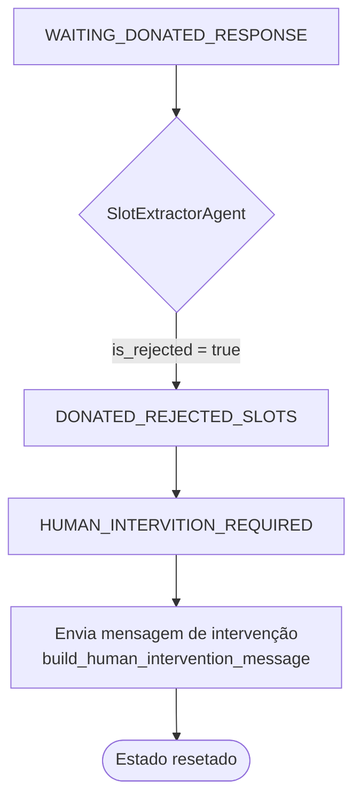

**Status:** ✅ Lógica implementada (`handlers.py:82–86`).
**Gap crítico:** Nenhuma notificação ao AEE. Estado é resetado. AEE não sabe que houve rejeição.

---

### Flow 3D — Mentor não responde (timeout)

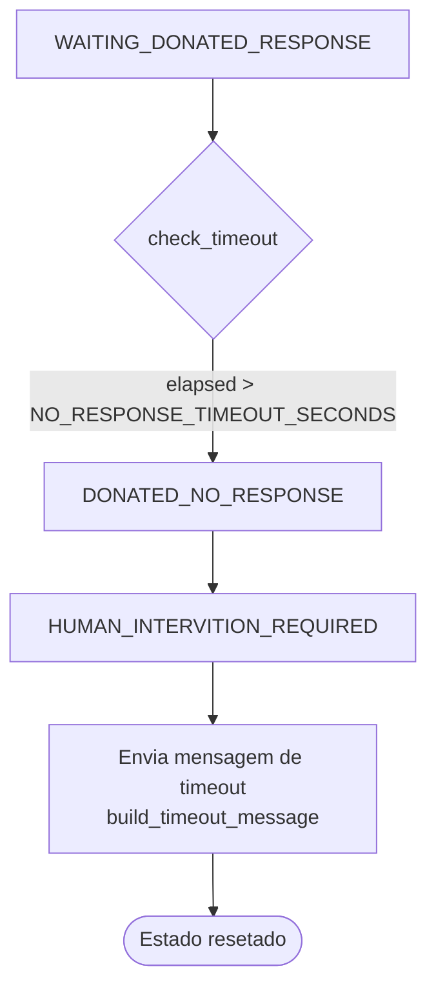

**Status:** ✅ Lógica implementada (`handlers.py:60–64`).
**Gap 1:** O timeout só é verificado quando o mentor envia uma mensagem. Se o mentor nunca responder, o check nunca roda. Requer Celery Beat para verificação periódica.
**Gap 2:** Sem notificação ao AEE.

---

### Flow 3E — Founder seleciona opção inválida / ambígua

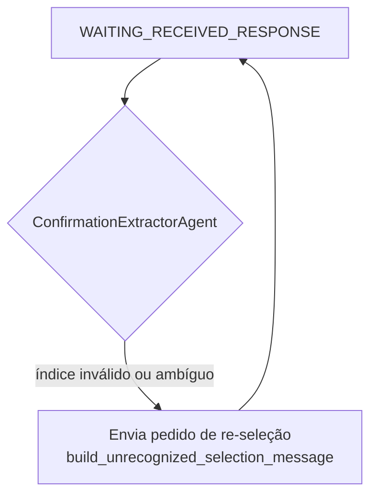

**Status:** ✅ Implementado (`handlers.py:144–146`). Estado não avança — aguarda nova resposta.
**Gap:** Sem contador de tentativas. Founder pode ficar em loop indefinido.

---

### Flow 3F — Founder rejeita todos os slots

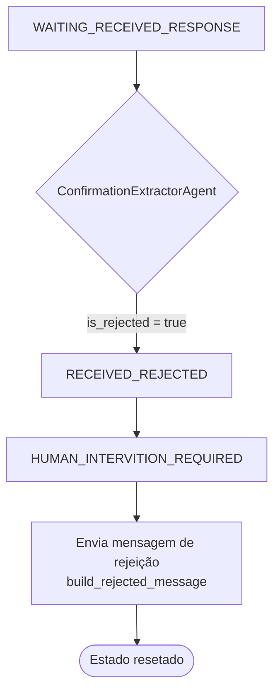

**Status:** ✅ Lógica implementada (`handlers.py:138–142`).
**Gap:** Sem notificação ao AEE. Sem loop para re-pedir slots ao mentor.

---

### Flow 3G — Founder não responde (timeout)

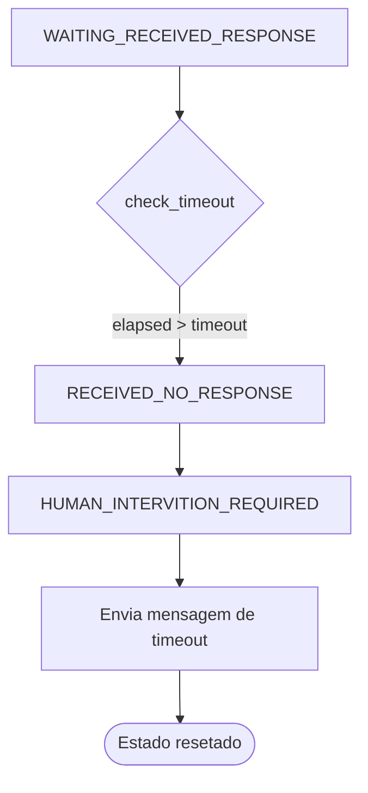

**Status:** ✅ Lógica implementada (`handlers.py:112–116`).
**Mesmos gaps do Flow 3D:** sem Celery Beat, sem notificação ao AEE.

---

### Flow 3H — Mensagem de mídia (áudio, imagem, sticker) [EC-06]

**Status:** Parcialmente implementado.
**O que existe:** Handler de fallback envia mensagem de texto. Estado NÃO é atualizado.
**Gap:** Se mentor está em `WAITING_DONATED_RESPONSE` e envia áudio, recebe fallback mas o estado permanece correto — próxima mensagem de texto é processada normalmente. Comportamento aceitável para MVP se verificado.
**Ação necessária:** Confirmar que o handler de mídia preserva o estado atual (não faz transição).

---

### Flow 3I — Chatbot aversion / recusa explícita [EC-10] — NÃO IMPLEMENTADO

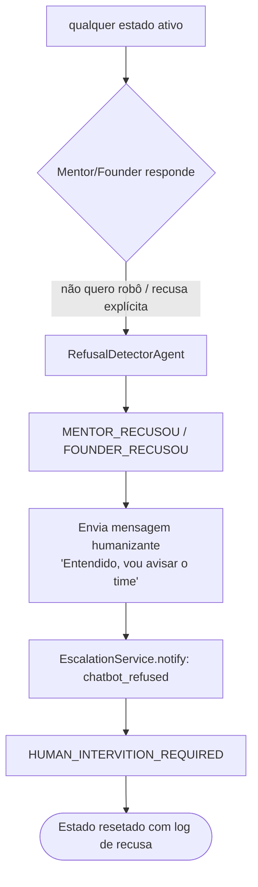

**Status:** ❌ Não implementado.
**Hoje:** recusa explícita é tratada como rejeição de slots (if `is_rejected`) ou como resposta ambígua — nem sempre chega ao estado correto, e nunca notifica o AEE.

---

### Flow 3J — Trigger duplicado [EC-12] — NÃO IMPLEMENTADO

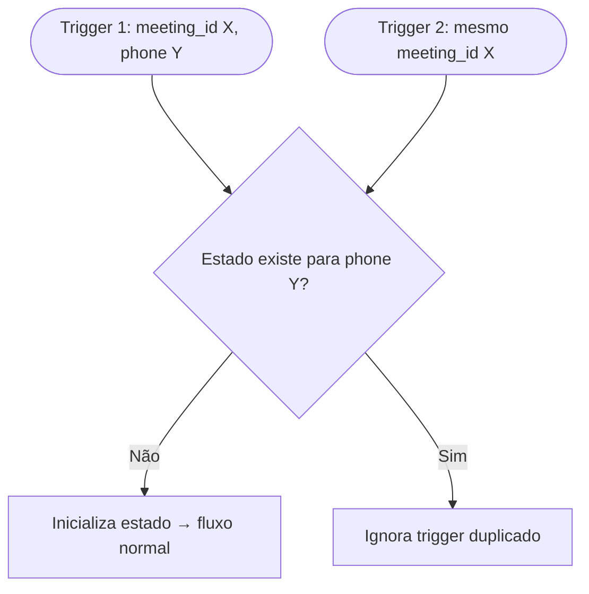

**Status:** ❌ Não implementado. Hoje dois triggers criariam dois fluxos concorrentes no mesmo `user_id` (phone number) no Redis, com risco de sobrescrição de estado.

---

### Flow 3K — Janela 24h expira entre mentor e founder [EC-09] — NÃO IMPLEMENTADO

**Cenário:** Mentor demora >24h para responder. Quando o agente tenta contatar o founder, a janela WhatsApp do founder (que nunca foi contactado) não está aberta — requer template.

**Status:** ❌ Não implementado. O `WhatsApp Window Service` verifica janela do remetente, mas não do próximo destinatário no fluxo.

---

### Flow 3L — Motor de Negociação: Founder com contra-proposta (EC-24, EC-28)

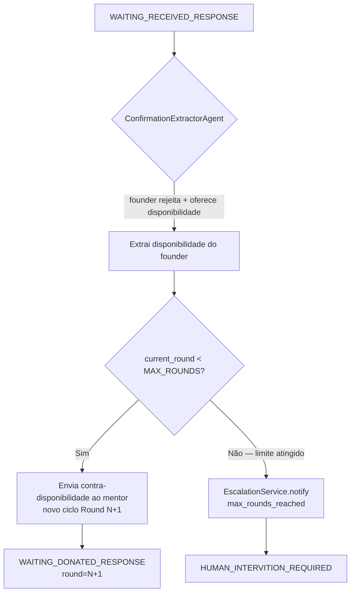

**Status:** ❌ Não implementado. Requer Motor de Negociação.
**Config:** `MAX_NEGOTIATION_ROUNDS=2` (padrão). `current_round` e `max_rounds` são campos de contexto no estado — não estados separados.

---

### Flow 3M — Cancelamento antes da confirmação (EC-39, EC-40)

```mermaid
flowchart TD
    ANY[qualquer estado ativo] --> A{Ator responde}
    A -->|"preciso cancelar" / "não quero mais"| B[DetectCancellationAgent]
    B --> C[Notifica o outro lado]
    C --> D[EscalationService.notify: cancelled_pre_confirm]
    D --> E[HUMAN_INTERVITION_REQUIRED]
```

**Status:** ❌ Não implementado.

---

### Flow 3N — Cancelamento/remarcação pós-confirmação (EC-41–44)

```mermaid
flowchart TD
    CONFIRMED[RECEIVED_CONFIRMED\nreunião agendada] --> A{Ator envia mensagem}
    A -->|"preciso remarcar" / "preciso cancelar"| B[DetectCancellationAgent]
    B --> C[Notifica AMBOS os lados imediatamente]
    C --> D[EscalationService.notify: cancelled_post_confirm]
    D --> E[Cancelar/atualizar GCal invite]
    E --> F{Remarcar?}
    F -->|Sim| G[Inicia novo ciclo — volta ao INIT]
    F -->|Não| H[HUMAN_INTERVITION_REQUIRED]
```

**Status:** ❌ Não implementado.

---

### Flow 3O — EscalationService (todos os caminhos de HI)

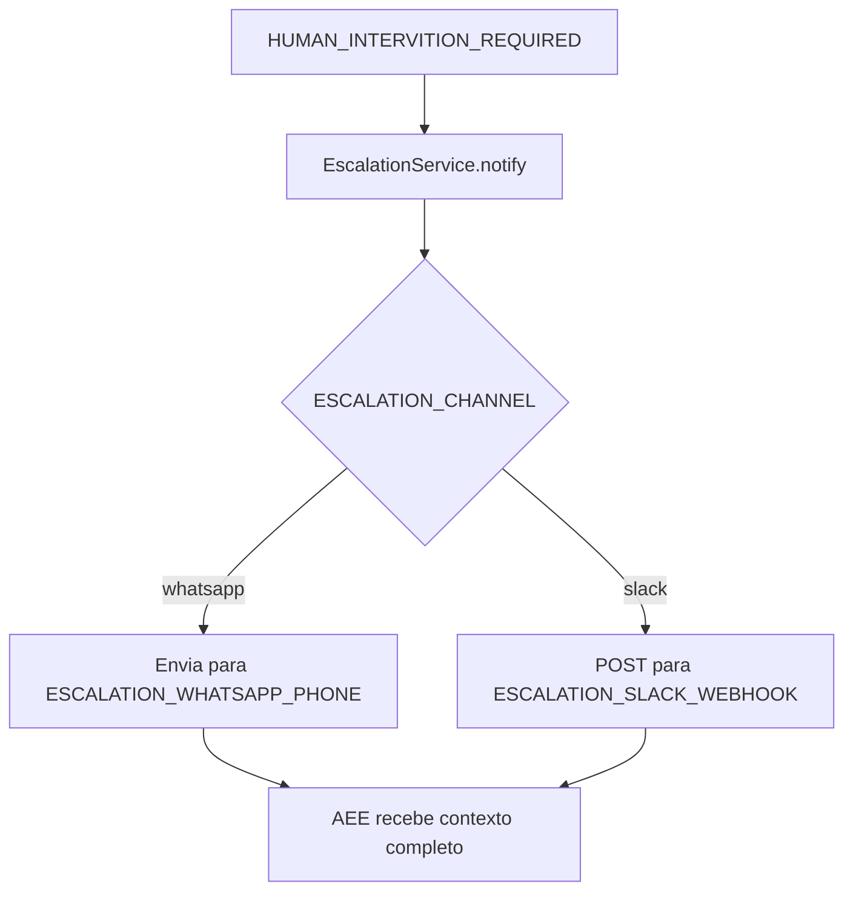

**Status:** ❌ Não implementado. Gap crítico EC-36. Sem este serviço, todos os caminhos de escalação são silenciosos.

---

### Flow 3P — Delegação de Contato no Trigger (EC-01, EC-25)

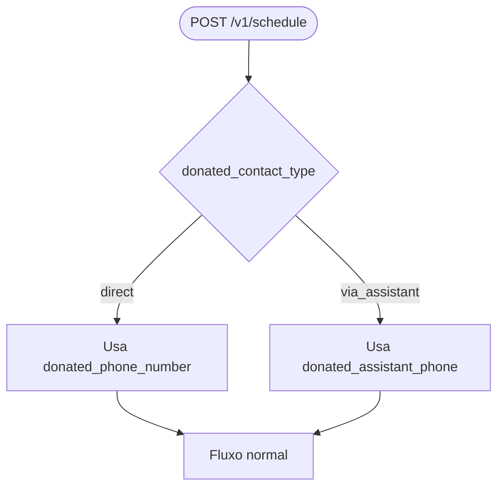

**Status:** ❌ Não implementado. Requer extensão do `ScheduleRequest` para incluir `donated_contact_type` e `donated_assistant_phone`.

---

## 4. Critérios de Handoff para Intervenção Humana

| Condição | Estado atual → destino | Notificação ao AEE | Implementado? |
|---|---|---|---|
| Mentor não responde após timeout | `WAITING_DONATED_RESPONSE` → `DONATED_NO_RESPONSE` → `HUMAN_INTERVITION_REQUIRED` | ❌ Não | Parcial (sem Celery Beat) |
| Mentor rejeita explicitamente | `WAITING_DONATED_RESPONSE` → `DONATED_REJECTED_SLOTS` → `HUMAN_INTERVITION_REQUIRED` | ❌ Não | ✅ Lógica sim |
| Founder não responde após timeout | `WAITING_RECEIVED_RESPONSE` → `RECEIVED_NO_RESPONSE` → `HUMAN_INTERVITION_REQUIRED` | ❌ Não | Parcial (sem Celery Beat) |
| Founder rejeita todos os slots | `WAITING_RECEIVED_RESPONSE` → `RECEIVED_REJECTED` → `HUMAN_INTERVITION_REQUIRED` | ❌ Não | ✅ Lógica sim |
| Recusa explícita do agente | qualquer → `HUMAN_INTERVITION_REQUIRED` | ❌ Não | ❌ Não |
| Ambiguidade após N tentativas | qualquer → `HUMAN_INTERVITION_REQUIRED` | ❌ Não | ❌ Não (sem contador) |
| Founder com contra-proposta após MAX_ROUNDS | `WAITING_RECEIVED_RESPONSE` → `HUMAN_INTERVITION_REQUIRED` | EscalationService | ❌ Não |
| Cancelamento pré-confirmação | qualquer ativo → `HUMAN_INTERVITION_REQUIRED` | EscalationService | ❌ Não |
| Cancelamento pós-confirmação | `RECEIVED_CONFIRMED` → `HUMAN_INTERVITION_REQUIRED` + GCal cancel | EscalationService | ❌ Não |
| Resposta emocional/agressiva | qualquer → `HUMAN_INTERVITION_REQUIRED` | EscalationService | ❌ Não |

> **Gap sistêmico:** EscalationService não existe — TODOS os caminhos para `HUMAN_INTERVITION_REQUIRED` são silenciosos. O AEE não recebe nenhuma notificação em nenhum cenário de escalação.

---

## 5. Canal de Notificação ao AEE — DECIDIDO

| Opção | Prós | Contras | Esforço |
|---|---|---|---|
| **WhatsApp** (mesmo número do agente) | Zero nova integração; AEE já usa WhatsApp | Mistura o canal do agente com monitoramento; pode confundir | Baixo |
| **Slack** | Canal dedicado; fácil de filtrar; suporta estrutura | Requer nova integração (Slack webhook ou bot) | Médio |
| **E-mail** | Registro formal; sem nova integração | AEE pode não ver em tempo real | Baixo |

**Decisão:** MVP usa WhatsApp (`ESCALATION_CHANNEL=whatsapp`, env var `ESCALATION_WHATSAPP_PHONE`). Slack disponível como alternativa configurável (`ESCALATION_CHANNEL=slack`, env var `ESCALATION_SLACK_WEBHOOK`). Refinamento pós-piloto.

---

## 6. Máquina de Estados Expandida (target state)

### Campos de contexto adicionados ao estado (não são estados separados)

| Campo | Tipo | Descrição |
|---|---|---|
| `current_round` | `int` | Rodada atual de negociação (inicia em 1) |
| `max_rounds` | `int` | Limite de rodadas (`MAX_NEGOTIATION_ROUNDS`, default 2) |

### Estados a adicionar (além dos 11 existentes)

| Estado novo | Trigger | Quem gera |
|---|---|---|
| `AWAITING_MENTOR_CLARIFICATION` | SlotExtractorAgent recebe resposta ambígua (1ª vez) | AmbiguityResolverAgent |
| `AWAITING_FOUNDER_CLARIFICATION` | ConfirmationExtractorAgent recebe seleção ambígua (1ª vez) | AmbiguityResolverAgent |
| `MENTOR_REFUSED_AGENT` | RefusalDetectorAgent detecta recusa | RefusalDetectorAgent |
| `FOUNDER_REFUSED_AGENT` | RefusalDetectorAgent detecta recusa | RefusalDetectorAgent |
| `AWAITING_MENTOR_FOLLOWUP` | Celery Beat detecta timeout sem resposta do mentor | TimeoutHandlerAgent |
| `RESCHEDULING_REQUESTED` | DetectCancellationAgent detecta pedido de remarcação pós-confirmação | DetectCancellationAgent — diferencia cancelamento de HI por comportamento |

### Estados a corrigir

| Estado atual | Problema | Correção |
|---|---|---|
| `HUMAN_INTERVITION_REQUIRED` | Typo: INTERVITION | Renomear para `HUMAN_INTERVENTION_REQUIRED` (breaking change — requer migração de Redis keys) |
| `WAITING_FOR_TEMPLATE_REPLY` | Definido mas sem handler | Implementar handler ou remover da lista |

---

## 7. Novos Agentes Necessários

| Agente | Input | Output | Prioridade |
|---|---|---|---|
| **RefusalDetectorAgent** | Texto da mensagem recebida | `{is_refusal: bool, sentiment: str}` | P0 — pré-piloto |
| **AmbiguityResolverAgent** | Texto ambíguo + contexto do estado | Mensagem de clarificação + contador de tentativas | P1 — piloto |
| **TimeoutHandlerAgent** | Estado atual + `last_interaction_time` | Mensagem de follow-up ou escalação | P1 — piloto |
| **NotificationAgent** / EscalationService | Contexto do caso + canal + `ESCALATION_CHANNEL` | Mensagem ao AEE via WhatsApp ou Slack | P1 — piloto |
| **DetectCancellationAgent** | Texto da mensagem + estado atual | `{is_cancellation: bool, wants_reschedule: bool}` | P1 — piloto |
| **CounterAvailabilityExtractorAgent** | Texto do founder com disponibilidade oferecida | Slots do founder para retornar ao mentor em novo ciclo | P1 — piloto |

---

## 8. Open Questions → Stage 7

| Questão | Status | Decisão |
|---|---|---|
| Canal de notificação ao AEE: WhatsApp vs Slack vs e-mail? | **DECIDIDO** | WhatsApp (MVP) ou Slack — configurável via `ESCALATION_CHANNEL` |
| SLA de timeout para mentor? | **DECIDIDO** | 48h — `NO_RESPONSE_TIMEOUT_SECONDS=172800`, configurável via env |
| SLA de timeout para founder? | **DECIDIDO** | 48h — mesma variável; pode ser diferenciado por env se necessário |
| Quantas tentativas de clarificação antes de human intervention? | **DECIDIDO** | 2x por round (por ator) |
| Redis ou MongoDB para persistência de estado? CLAUDE.md diz MongoDB, código usa Redis | **Em aberto** | Confirmar com Brunão — impacta TTL, histórico, análise pós-piloto |
| O typo `INTERVITION` deve ser corrigido antes do piloto? | **Em aberto** | Decisão de eng — Brunão (breaking change em Redis keys) |
| `WAITING_FOR_TEMPLATE_REPLY` — implementar handler ou remover? | **Em aberto** | Decisão de eng — Brunão |
