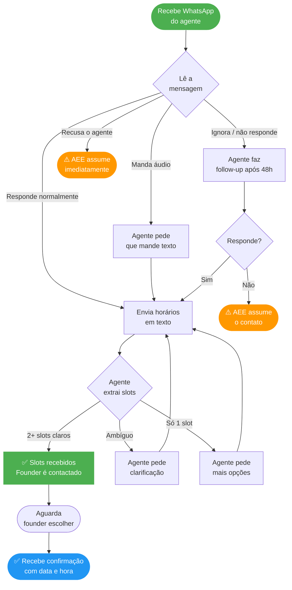
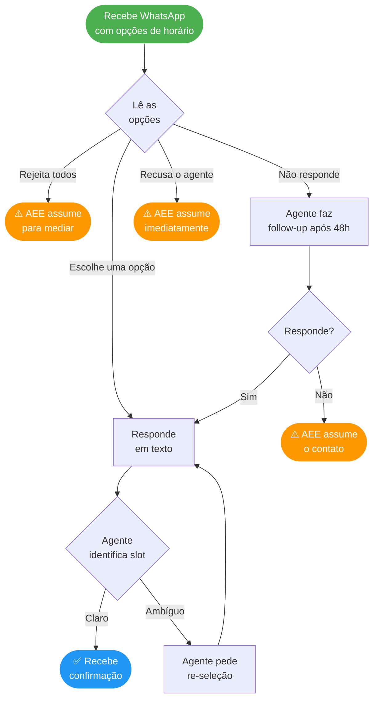
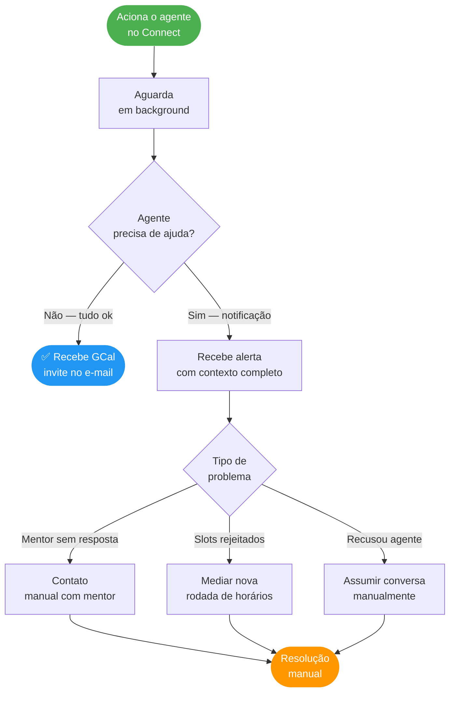

# Agent Journey — Jornada dos Atores

> Versão: 2.1 | Data: 2026-03-16

> **Para visualizar:** abra no GitHub (renderiza automaticamente)
> **Para usar no Miro:** copie qualquer bloco `mermaid` → Miro → "+" → More → Mermaid → cole. O Miro converte em shapes editáveis.

---

## Happy Path — Swimlane

---

## Jornada do Mentor

---

## Jornada do Founder

---

## Jornada do AEE

---

## Legenda

| Cor | Significado |
|---|---|
| 🟢 Verde | Início / sucesso |
| 🔵 Azul | Ação do agente concluída |
| 🟠 Laranja | Intervenção humana necessária |
| ⬜ Cinza | Passo intermediário |
