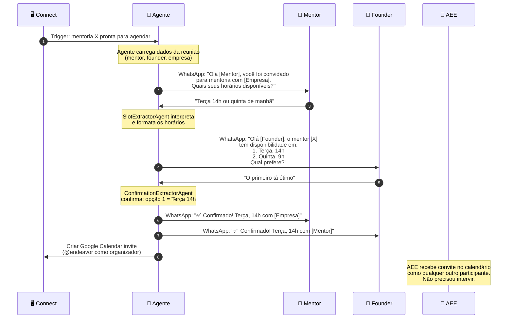
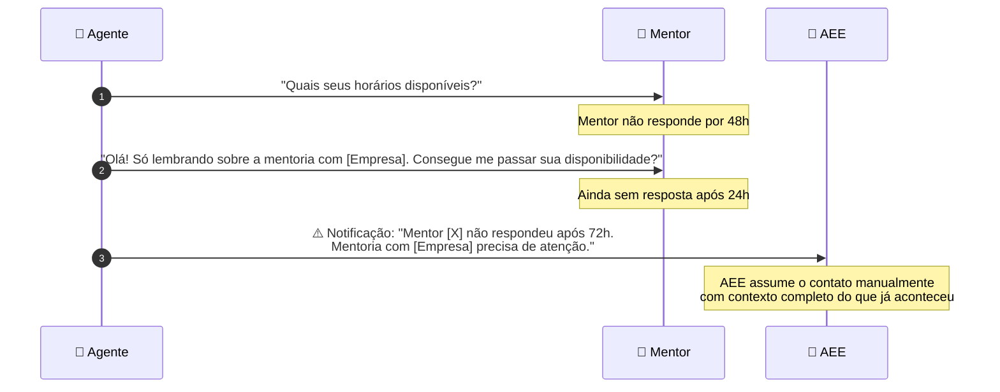
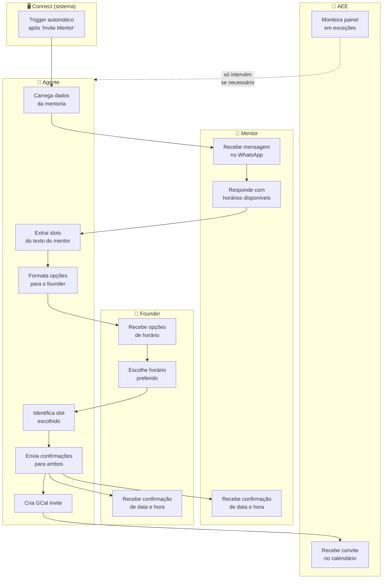

# Agent Journey — Jornada Simplificada

> Versão: 1.0 | Data: 2026-03-16
> Público: PM, stakeholders, AEE, Arua
> Sem detalhes técnicos — foco na experiência de cada ator

---

## Happy Path — O que cada ator vive



---

## Quando algo dá errado — O que o AEE vê



---

## Visão Swimlane — Happy Path Completo



---

## Os 3 Cenários em Uma Página

| Cenário | Mentor | Founder | AEE | Resultado |
|---|---|---|---|---|
| **😊 Happy path** | Responde com 2+ horários | Escolhe um | Não intervém | GCal invite criado automaticamente |
| **😕 Ambiguidade** | Responde vagamente ("qualquer manhã") | — | — | Agente pede esclarecimento uma vez. Se resolver → happy path. Se não → AEE notificado |
| **😓 Sem resposta** | Não responde em 48h | — | — | Agente faz 1 follow-up. Após +24h → AEE notificado com contexto completo |
| **😤 Recusa** | "Não quero falar com robô" | — | — | Agente responde com respeito e aciona AEE imediatamente |
| **❌ Founder rejeita tudo** | Propôs horários | Rejeita todos | — | AEE notificado para mediar nova rodada |

---

## Experiência por Ator

### 👤 Mentor — O que ele vive

```
[Recebe no WhatsApp]
─────────────────────────────────────────────────────
"Olá [Nome]! 👋

Você foi confirmado como mentor para [Empresa].

Para organizarmos a reunião, poderia me passar
2 ou mais opções de horário disponíveis para você?"
─────────────────────────────────────────────────────

[Responde]
"Pode ser terça depois das 14h ou qualquer
manhã de quinta ou sexta"

[Recebe confirmação]
─────────────────────────────────────────────────────
"✅ Perfeito! Reunião confirmada:

📅 Terça-feira, 15h
🏢 [Empresa] — [Nome do Founder]

Você receberá o convite no seu e-mail. Obrigado!"
─────────────────────────────────────────────────────
```

**Tempo total de interação: ~2 minutos**
**Número de mensagens recebidas: 2**

---

### 🏢 Founder — O que ele vive

```
[Recebe no WhatsApp — após mentor confirmar disponibilidade]
─────────────────────────────────────────────────────
"Olá [Nome]! 👋

O mentor [X] está disponível nos seguintes horários:

1. Terça-feira, 14h
2. Quinta-feira, 9h
3. Sexta-feira, 10h

Qual horário você prefere?"
─────────────────────────────────────────────────────

[Responde]
"O primeiro"

[Recebe confirmação]
─────────────────────────────────────────────────────
"✅ Reunião confirmada!

📅 Terça-feira, 14h
👤 Mentor: [Nome do Mentor]

Você receberá o convite no seu e-mail. Bom papo! 🚀"
─────────────────────────────────────────────────────
```

**Tempo total de interação: ~1 minuto**
**Número de mensagens recebidas: 2**

---

### 👩 AEE — O que ela vive

**Hoje (manual):**
```
1. Clica em "Invite Mentor" no Connect
2. Abre WhatsApp pessoal
3. Escreve mensagem improvisada para o mentor
4. Aguarda resposta (horas ou dias)
5. Encaminha horários para o founder
6. Aguarda founder escolher
7. Abre Google Calendar
8. Cria evento manualmente
9. Atualiza Connect manualmente
─────────────────────────
⏱ Tempo médio: 30–60 min distribuídos ao longo de dias
```

**Com o agente:**
```
1. Clica em "Invite Mentor" no Connect (ou aciona o agente)
2. ☕ Aguarda
3. Recebe o GCal invite no e-mail como qualquer participante
─────────────────────────
⏱ Tempo médio: < 5 min (só monitoramento de exceções)
```

---

## O Agente em Uma Frase

> O agente substitui o AEE como intermediário de logística entre mentor e founder — conduzindo a troca de mensagens, extraindo horários, confirmando a escolha, e criando o convite no calendário — sem que nenhuma das partes precise saber que é um sistema automatizado.
