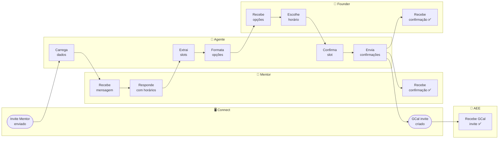
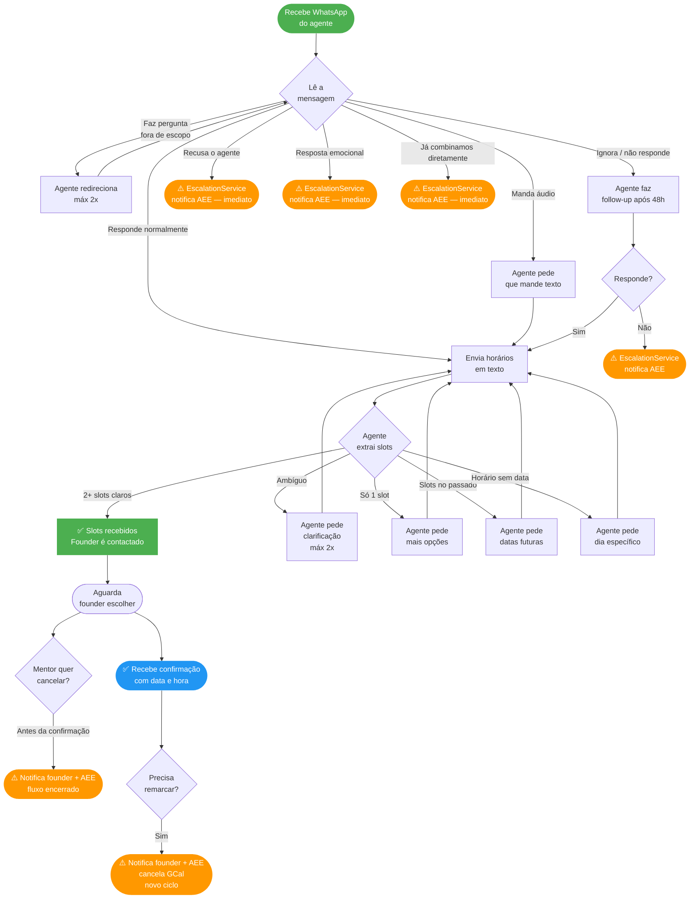
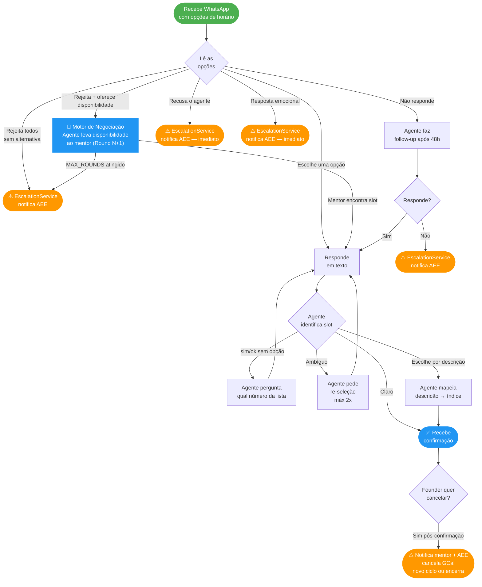
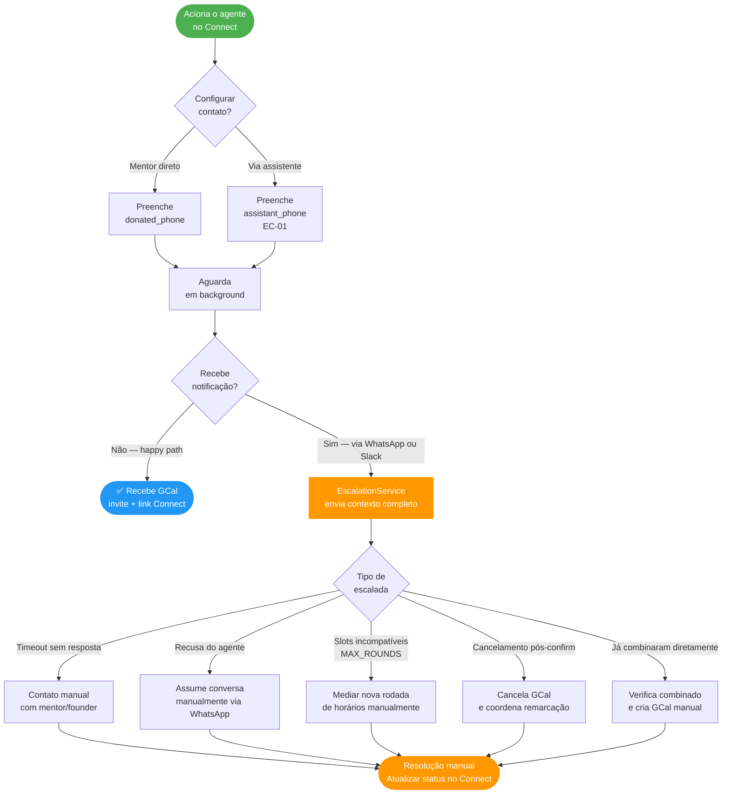

# Agent Journey — Jornada dos Atores

> Versão: 3.0 | Data: 2026-03-16

> **Para visualizar:** abra no GitHub (renderiza automaticamente)
> **Para usar no Miro:** copie qualquer bloco `mermaid` → Miro → "+" → More → Mermaid → cole.

---

## Happy Path — Swimlane

---

## Jornada do Mentor

Inclui edge cases comportamentais do lado do mentor.

---

## Jornada do Founder

Inclui motor de negociação (contra-proposta) e cancelamento.

---

## Jornada do AEE

Inclui EscalationService como canal de notificação e os cenários de intervenção expandidos.

---

## Legenda

| Cor | Significado |
|---|---|
| 🟢 Verde | Início / sucesso |
| 🔵 Azul | Ação do agente concluída / Motor de Negociação |
| 🟠 Laranja | Intervenção humana via EscalationService |
| ⬜ Cinza | Passo intermediário |
