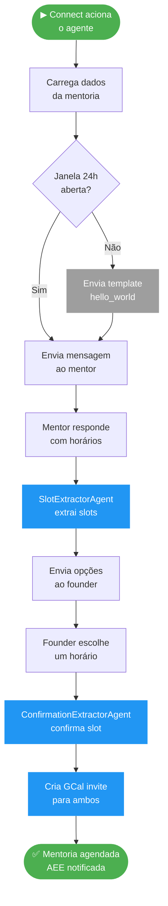
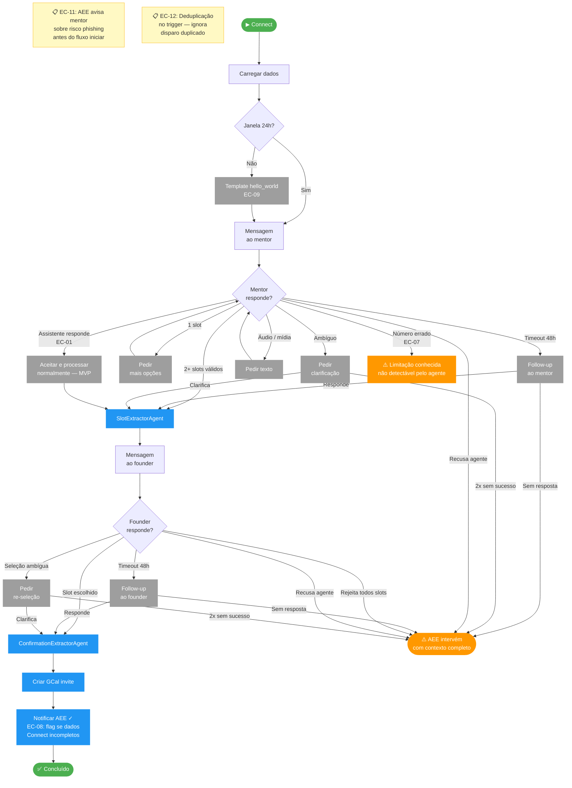
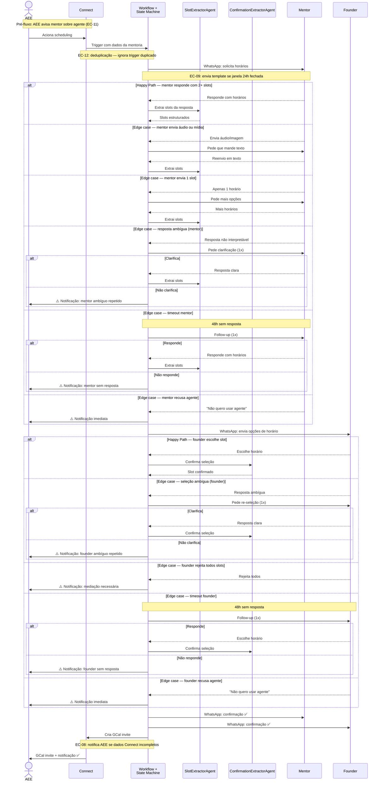
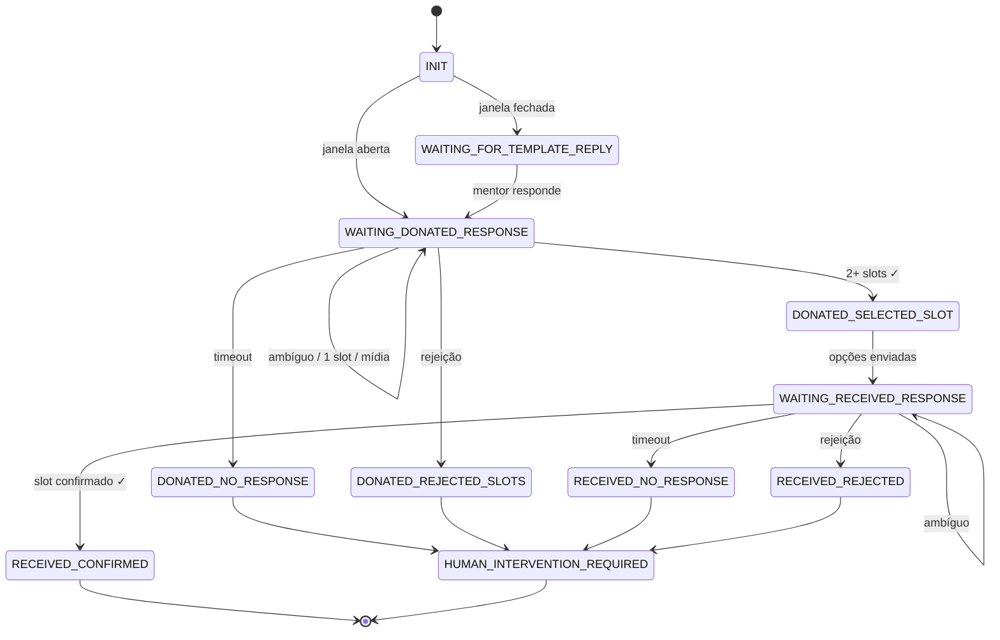

# Flow Diagram — Scheduling Agent

> Versão: 3.0 | Data: 2026-03-16

> **Para visualizar:** abra no GitHub (renderiza automaticamente)
> **Para usar no Miro:** copie qualquer bloco `mermaid` → Miro → "+" → More → Mermaid → cole. O Miro converte em shapes editáveis.

---

## Diagrama 1 — Happy Path

Fluxo ideal sem desvios. Objetivo: qualquer pessoa entende em 10 segundos o que o agente faz.

---

## Diagrama 2 — Fluxo Completo com Edge Cases

Happy path é a espinha central. Edge cases do mentor saem para a esquerda; do founder, para a direita. Todos os caminhos de intervenção convergem para um único nó ⚠️ AEE.

**Legenda de cores:**
| Cor | Significado |
|---|---|
| 🟢 Verde | Início / fim com sucesso |
| 🔵 Azul | Ação do agente concluída |
| 🟠 Laranja | Intervenção humana (AEE assume) |
| ⬜ Cinza | Passo intermediário / edge case tratado |
| 🟡 Amarelo | Nota de contexto / pré-condição |

---

## Diagrama 3 — Orquestração de Agentes

Quem chama quem. Cenários: happy path, edge cases do mentor, edge cases do founder.

---

## Máquina de Estados

