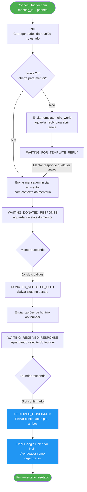
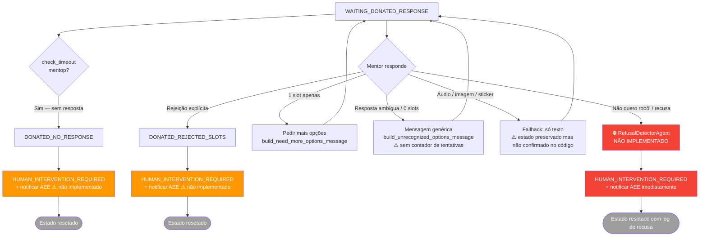
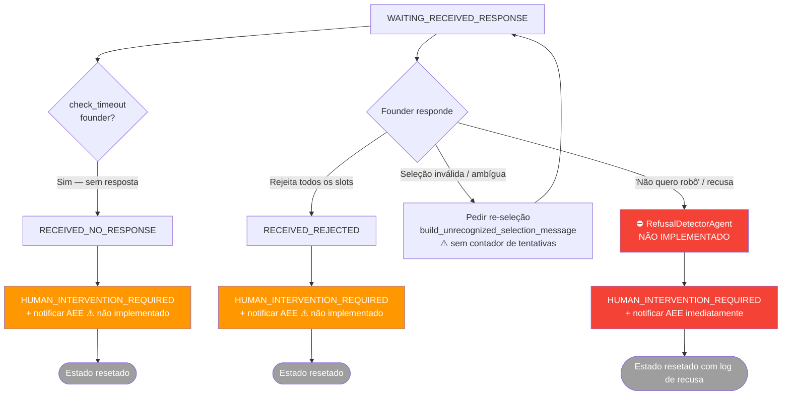
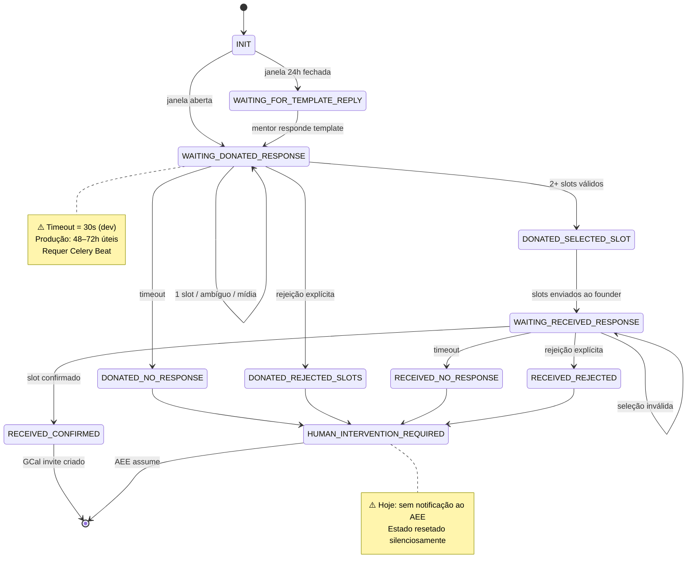
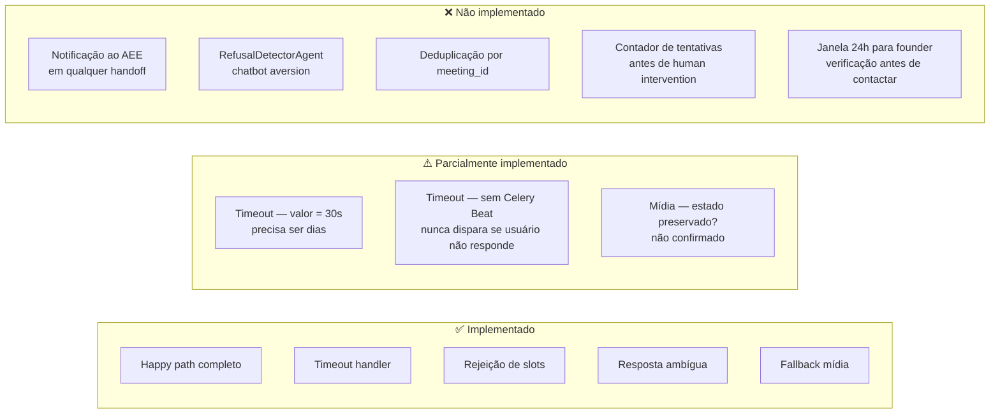

# Flow Diagram — Scheduling Agent (Completo)

> Versão: 1.0 | Data: 2026-03-16
> Público: devs, tech lead, PM
> Baseado em: Stage 6 (flow map) + leitura direta do código

---

## 1. Happy Path

---

## 2. Branches Alternativos — Lado Mentor

---

## 3. Branches Alternativos — Lado Founder

---

## 4. Máquina de Estados — Visão Completa

---

## 5. Gaps Críticos de Implementação (resumo visual)

---

## Legenda de Status

| Cor / Símbolo | Significado |
|---|---|
| 🟢 Verde | Implementado e funcionando |
| 🟠 Laranja | Parcialmente implementado — gap crítico |
| 🔴 Vermelho | Não implementado — bloqueia piloto |
| ⚪ Cinza | Estado terminal — reseta estado |
