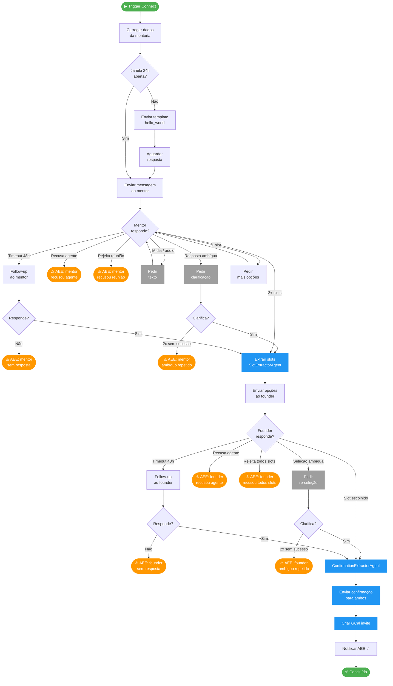
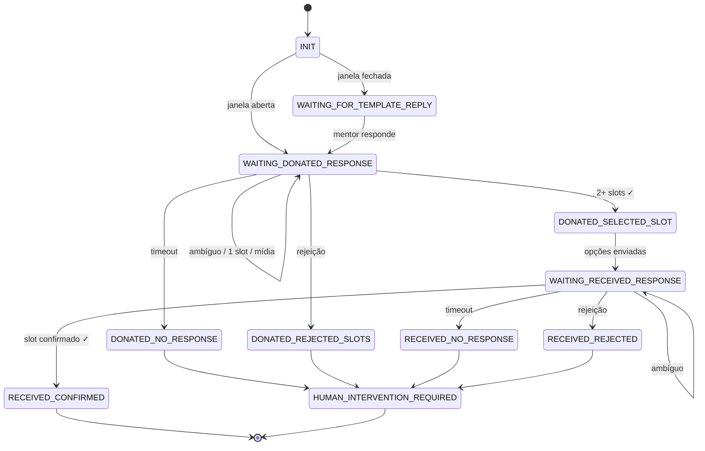

# Flow Diagram — Scheduling Agent

> Versão: 2.0 | Data: 2026-03-16

---

## Fluxo Completo

```mermaid
flowchart TD
    START([▶ Trigger Connect]) --> LOAD[Carregar dados\nda mentoria]
    LOAD --> WIN{Janela 24h\naberta?}

    WIN -->|Não| TPL[Enviar template\nhello_world]
    TPL --> TWAIT[Aguardar\nresposta]
    TWAIT --> MSG1

    WIN -->|Sim| MSG1[Enviar mensagem\nao mentor]
    MSG1 --> MWAIT{Mentor\nresponde?}

    MWAIT -->|Timeout 48h| MFOLLOW[Follow-up\nao mentor]
    MFOLLOW --> MWAIT2{Responde?}
    MWAIT2 -->|Não| HI1

    MWAIT -->|Recusa agente| HI2
    MWAIT -->|Rejeita reunião| HI3
    MWAIT -->|Mídia / áudio| MEDIA[Pedir\ntexto]
    MEDIA --> MWAIT

    MWAIT -->|Resposta ambígua| MAMB[Pedir\nclarificação]
    MAMB --> MAMB2{Clarifica?}
    MAMB2 -->|2x sem sucesso| HI4
    MAMB2 -->|Sim| MSLOTS

    MWAIT -->|1 slot| MONE[Pedir\nmais opções]
    MONE --> MWAIT

    MWAIT -->|2+ slots| MSLOTS[Extrair slots\nSlotExtractorAgent]
    MWAIT2 -->|Sim| MSLOTS

    MSLOTS --> MSG2[Enviar opções\nao founder]
    MSG2 --> FWAIT{Founder\nresponde?}

    FWAIT -->|Timeout 48h| FFOLLOW[Follow-up\nao founder]
    FFOLLOW --> FWAIT2{Responde?}
    FWAIT2 -->|Não| HI5

    FWAIT -->|Recusa agente| HI6
    FWAIT -->|Rejeita todos slots| HI7

    FWAIT -->|Seleção ambígua| FAMB[Pedir\nre-seleção]
    FAMB --> FAMB2{Clarifica?}
    FAMB2 -->|2x sem sucesso| HI8
    FAMB2 -->|Sim| FCONF

    FWAIT -->|Slot escolhido| FCONF[ConfirmationExtractorAgent]
    FWAIT2 -->|Sim| FCONF

    FCONF --> SEND[Enviar confirmação\npara ambos]
    SEND --> GCAL[Criar GCal invite]
    GCAL --> NOTIFY[Notificar AEE ✓]
    NOTIFY --> END([✅ Concluído])

    HI1([⚠️ AEE: mentor\nsem resposta])
    HI2([⚠️ AEE: mentor\nrecusou agente])
    HI3([⚠️ AEE: mentor\nrecusou reunião])
    HI4([⚠️ AEE: mentor\nambíguo repetido])
    HI5([⚠️ AEE: founder\nsem resposta])
    HI6([⚠️ AEE: founder\nrecusou agente])
    HI7([⚠️ AEE: founder\nrecusou todos slots])
    HI8([⚠️ AEE: founder\nambíguo repetido])

    style START fill:#4CAF50,color:#fff,stroke:none
    style END fill:#4CAF50,color:#fff,stroke:none
    style GCAL fill:#2196F3,color:#fff,stroke:none
    style SEND fill:#2196F3,color:#fff,stroke:none
    style FCONF fill:#2196F3,color:#fff,stroke:none
    style MSLOTS fill:#2196F3,color:#fff,stroke:none
    style HI1 fill:#FF9800,color:#fff,stroke:none
    style HI2 fill:#FF9800,color:#fff,stroke:none
    style HI3 fill:#FF9800,color:#fff,stroke:none
    style HI4 fill:#FF9800,color:#fff,stroke:none
    style HI5 fill:#FF9800,color:#fff,stroke:none
    style HI6 fill:#FF9800,color:#fff,stroke:none
    style HI7 fill:#FF9800,color:#fff,stroke:none
    style HI8 fill:#FF9800,color:#fff,stroke:none
    style MEDIA fill:#9E9E9E,color:#fff,stroke:none
    style MAMB fill:#9E9E9E,color:#fff,stroke:none
    style FAMB fill:#9E9E9E,color:#fff,stroke:none
```

---

## Máquina de Estados

```mermaid
stateDiagram-v2
    [*] --> INIT
    INIT --> WAITING_FOR_TEMPLATE_REPLY : janela fechada
    INIT --> WAITING_DONATED_RESPONSE : janela aberta
    WAITING_FOR_TEMPLATE_REPLY --> WAITING_DONATED_RESPONSE : mentor responde
    WAITING_DONATED_RESPONSE --> WAITING_DONATED_RESPONSE : ambíguo / 1 slot / mídia
    WAITING_DONATED_RESPONSE --> DONATED_SELECTED_SLOT : 2+ slots ✓
    WAITING_DONATED_RESPONSE --> DONATED_NO_RESPONSE : timeout
    WAITING_DONATED_RESPONSE --> DONATED_REJECTED_SLOTS : rejeição
    DONATED_SELECTED_SLOT --> WAITING_RECEIVED_RESPONSE : opções enviadas
    WAITING_RECEIVED_RESPONSE --> WAITING_RECEIVED_RESPONSE : ambíguo
    WAITING_RECEIVED_RESPONSE --> RECEIVED_CONFIRMED : slot confirmado ✓
    WAITING_RECEIVED_RESPONSE --> RECEIVED_NO_RESPONSE : timeout
    WAITING_RECEIVED_RESPONSE --> RECEIVED_REJECTED : rejeição
    DONATED_NO_RESPONSE --> HUMAN_INTERVENTION_REQUIRED
    DONATED_REJECTED_SLOTS --> HUMAN_INTERVENTION_REQUIRED
    RECEIVED_NO_RESPONSE --> HUMAN_INTERVENTION_REQUIRED
    RECEIVED_REJECTED --> HUMAN_INTERVENTION_REQUIRED
    RECEIVED_CONFIRMED --> [*]
    HUMAN_INTERVENTION_REQUIRED --> [*]
```
