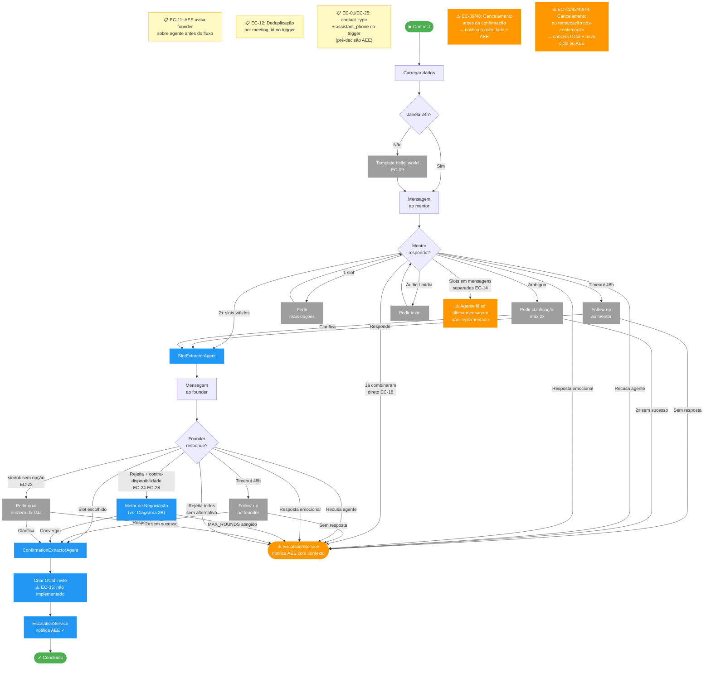
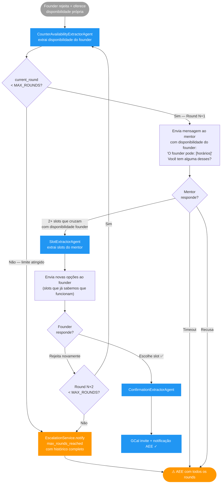
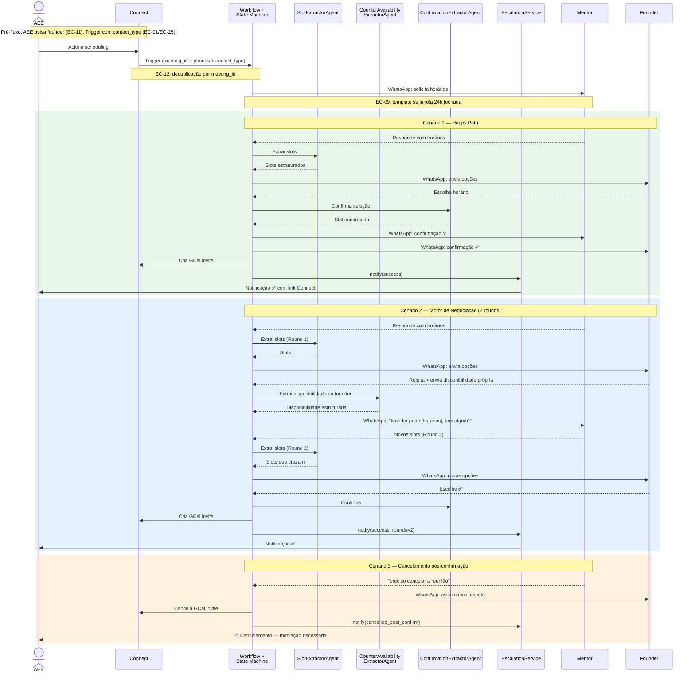
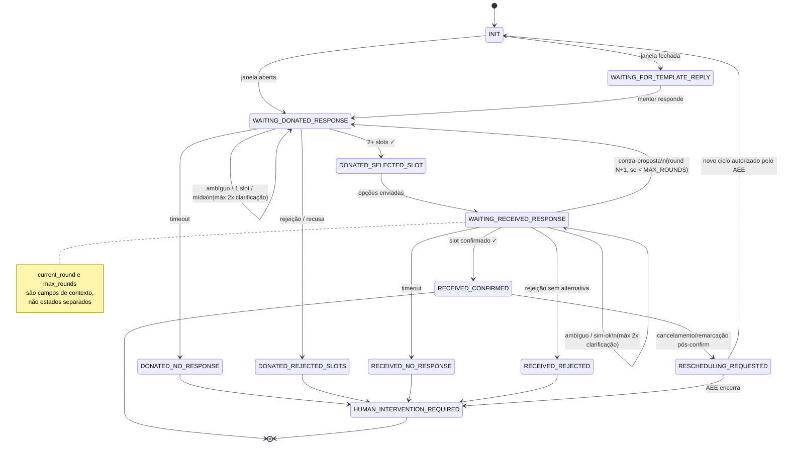

# Flow Diagram — Scheduling Agent

> Versão: 4.0 | Data: 2026-03-16

> **Para visualizar:** abra no GitHub (renderiza automaticamente)
> **Para usar no Miro:** copie qualquer bloco `mermaid` → Miro → "+" → More → Mermaid → cole. O Miro converte em shapes editáveis.

---

## Diagrama 1 — Happy Path

Fluxo ideal sem desvios. Qualquer pessoa entende em 10 segundos.

---

## Diagrama 2 — Fluxo Completo com Edge Cases

Happy path é a espinha central. Edge cases do mentor saem para a esquerda; do founder, para a direita. Todos os caminhos de intervenção convergem para ⚠️ AEE via EscalationService.

> EC-24 e EC-28 (founder com contra-disponibilidade) ativam o **Motor de Negociação** — ver Diagrama 2B.
> EC-39–44 (cancelamentos/remarcações) podem ocorrer em qualquer ponto do fluxo.

**Legenda:**
| Cor | Significado |
|---|---|
| 🟢 Verde | Início / fim com sucesso |
| 🔵 Azul | Ação do agente concluída |
| 🟠 Laranja | Intervenção humana / gap de implementação |
| ⬜ Cinza | Passo intermediário / edge case tratado |
| 🟡 Amarelo | Nota de pré-condição ou contexto |

---

## Diagrama 2B — Motor de Negociação (Vai-e-Vem)

Ativado quando o founder rejeita os slots e oferece contra-disponibilidade (EC-24, EC-28) ou quando o mentor atualiza slots enquanto o founder ainda escolhe (EC-20).

**Variável de controle:** `current_round` e `max_rounds` são armazenados no `MeetingContext` (não como estados separados — evita explosão de estados). Recomendado: `MAX_NEGOTIATION_ROUNDS = 2`.

---

## Diagrama 3 — Orquestração de Agentes

Sequência de chamadas entre atores em 3 cenários: happy path, motor de negociação, cancelamento.

---

## Diagrama 4 — Máquina de Estados

> **Nota:** `HUMAN_INTERVITION_REQUIRED` é o nome atual no código (typo). Será corrigido para `HUMAN_INTERVENTION_REQUIRED` em breaking-change coordenada com Brunão (requer migração de Redis keys).
